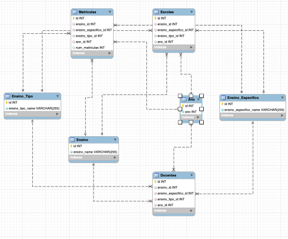

# mysqlCensoEscolar
Projeto Desenvolvido em MySQL para Disciplina de Hands On Work do CST em Ciência de Dados da UNIVALI.

Video apresentação: https://www.youtube.com/watch?v=UT0PT7BrE44&t=260s

Schema banco de dados:

